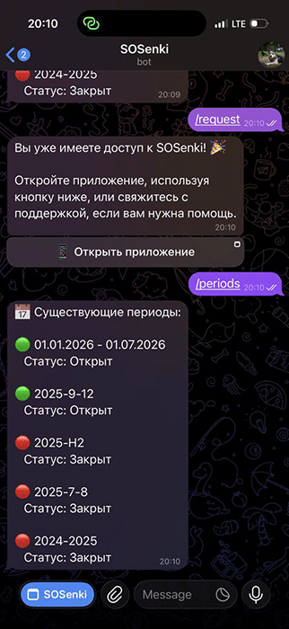
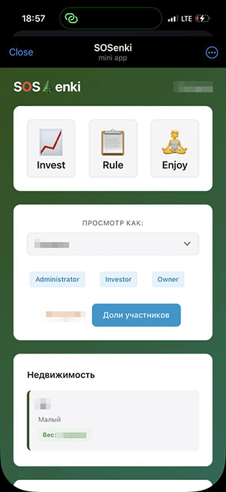
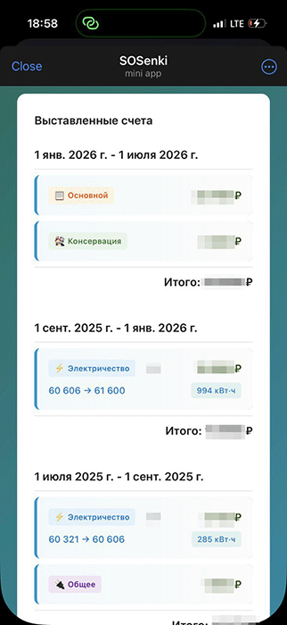
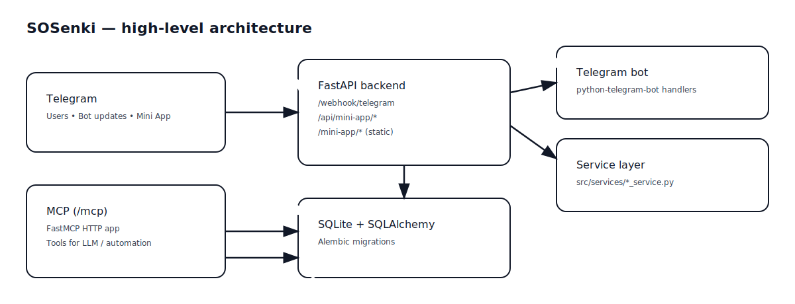
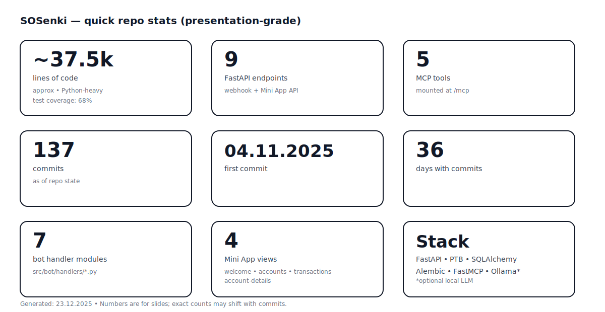

# SOSenki

---

## 1) Why

- Shared expenses for small communities
- Google Sheets/Excel Hell
- Telegram-first and only, self-hosted
- Transparent balances and bills

---

## 2) What SOSenki is

---

## 2) What SOSenki is

- Seeding from Google Sheets
- Telegram Bot + Mini App + FastAPI backend
- Automate Balance • Bills • Transactions • Periods
- AI Companion for admin tasks (LLM + MCP)
- Raspberry Pi or similar self-hosted

---

## 2) What SOSenki is

|  |  |  |
|---|---|---|

---

## 3) Architecture

---

## 4) Repo facts

---

## 5) What’s next

- Already in Production 🎉
- Roadmap: LLM/MCP + admin safety
- Star: [github.com/shared-goals/sosenki](https://github.com/shared-goals/sosenki)
- Share with territory developers
- Deploy and send feedback!

---

## Enjoy!

